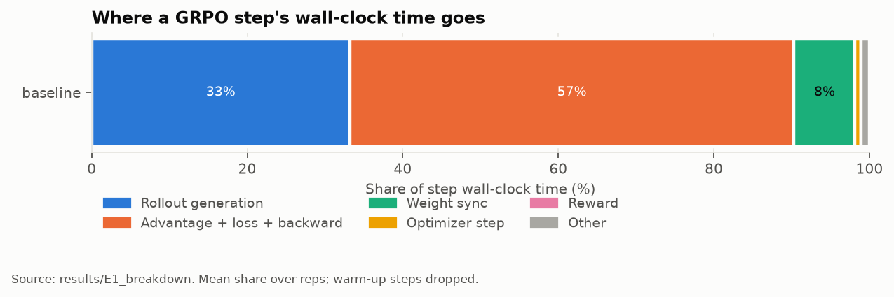
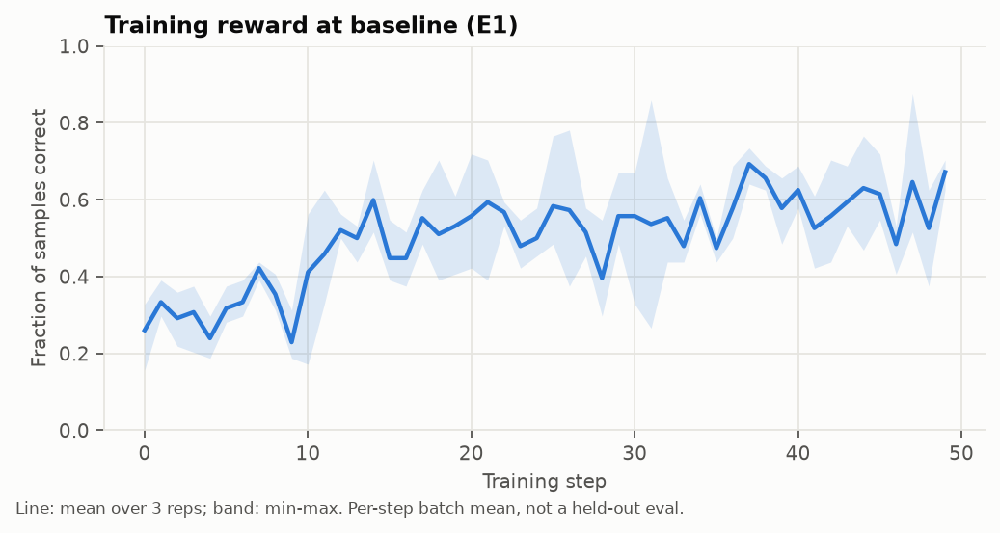
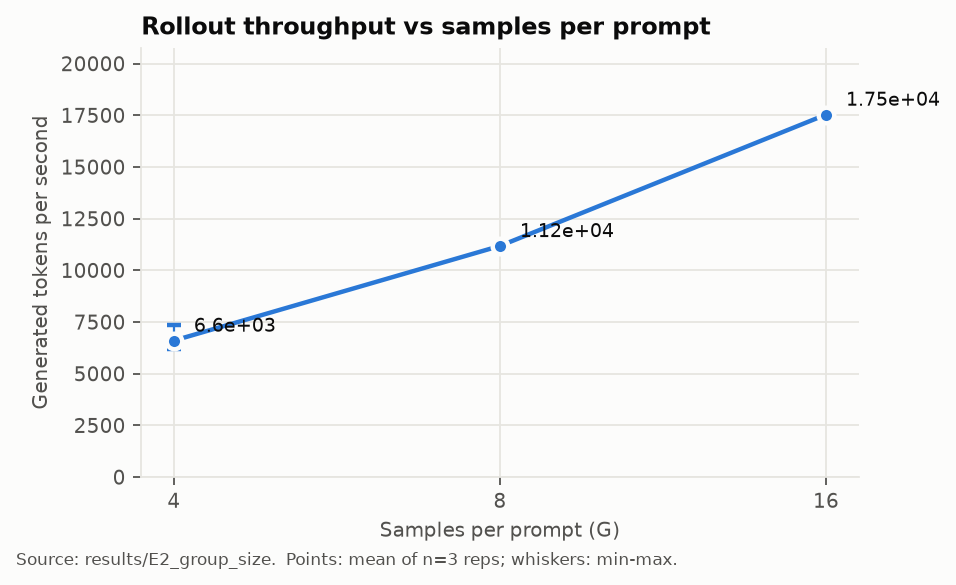
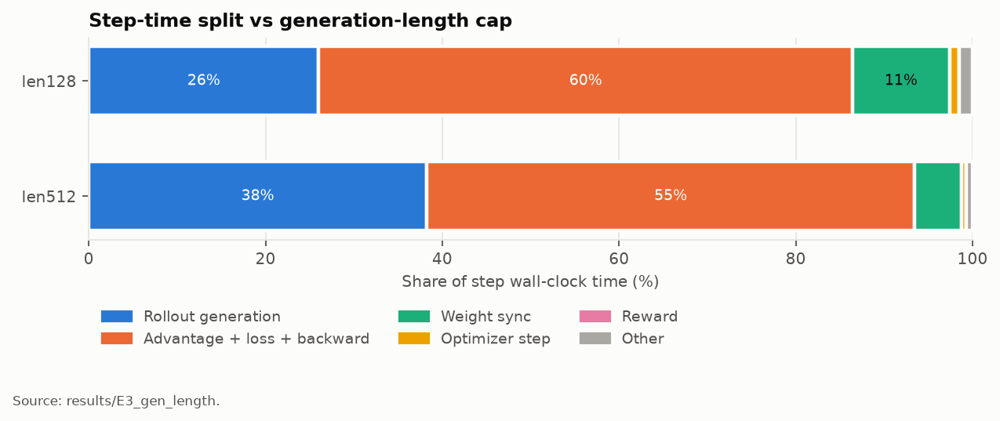
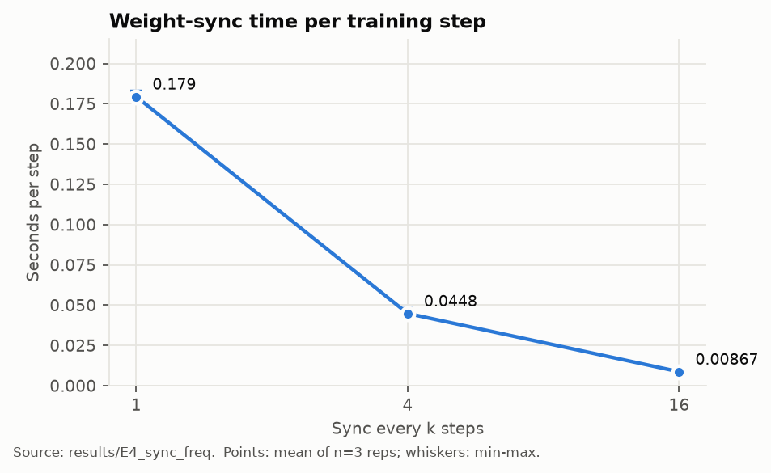

# Where does GRPO training time go? A rollout-infrastructure profile

> **Status: in progress.** E1 is complete. Sections for experiments not yet run say
> TODO. Every number traces to a file in `results/`; nothing here is estimated.

## Summary

TODO after E1–E4.

## 1. Setup

| Item | Value | Source |
|---|---|---|
| GPU / driver / CUDA | NVIDIA H100 80GB HBM3, driver 615.71.09, torch 2.13.0+cu129 | `results/E1_breakdown/baseline/rep0/run.json` → `env` |
| Model | Qwen2.5-1.5B-Instruct, full fine-tune, bf16 | `configs/baseline.yaml` |
| Framework | TRL 1.14.2 `GRPOTrainer`, vLLM 0.30.0 colocated on the same GPU | DECISIONS.md |
| Task | GSM8K, 1,000 frozen training problems (seed 0) | `data/gsm8k_subset/manifest.json` |
| Reward | exact match on the number after `####` (1.0), plus 0.1 for the `#### <n>` format | `rlstudy/reward.py` |
| Batch | 8 prompts × 8 samples = 64 completions per step, max 256 new tokens; one generation round per step, loss computed in 4 micro-batches of 16 (64 at once ran out of memory) | `configs/baseline.yaml` |
| KL / reference model | none (`beta = 0`) | `configs/baseline.yaml` |

## 2. Methodology

**What one training step contains.** With TRL on one GPU, a step runs strictly in
sequence in one process: copy the latest weights into vLLM (weight sync), generate
64 answers (rollout), score them (reward), run a no-grad forward pass to get the
trainer's own log-probabilities for the sampled tokens (old log-probs, used to
correct for vLLM/trainer numeric differences), compute group-relative advantages and
the loss, backpropagate, and step the optimizer. NOTES.md traces this data flow.

**How time is attributed.** `rlstudy/timing.py` charges every nanosecond of a step
to exactly one bucket:

| Bucket | Contains |
|---|---|
| `rollout_gen` | vLLM `generate` (or HF `generate`) and converting outputs to token lists |
| `weight_sync` | `VLLMGeneration.sync_weights()`: one device-to-device copy per parameter |
| `reward` | the two reward functions (pure Python) |
| `advantage_loss` | tokenizing/padding, old-log-prob forward, advantages, and the loss forward + backward of every micro-batch |
| `optimizer_step` | `optimizer.step()` |
| `other` | the remainder: next-batch fetch, gradient clipping, `zero_grad`, LR schedule, logging |

Three rules keep the attribution honest:

1. **Wait for the GPU before reading the clock.** GPU kernels run asynchronously, so
   every span boundary calls `torch.cuda.synchronize()`. Without it, the backward
   pass's time would be charged to whichever later stage first waits on the GPU.
   `tests/test_timing.py` demonstrates both cases on a simulated GPU.
2. **Never count time twice.** TRL calls generation and rewards from inside its
   training step, so stages nest. Each stage is charged its exclusive time (its time
   minus the stages inside it), and `other` is the remainder, so buckets always sum
   to the step's wall clock.
3. **Step windows tile the run.** Each step's window runs from one `on_step_end` to
   the next, so no wall-clock time falls between steps.

**What is excluded from summaries.** The first 2 steps of every run (CUDA graph
capture and compilation warm-up) and any step captured under `torch.profiler`
(profiling slows steps; those runs are separate "profiled" arms).

**Measurement overhead (E0).** TODO: step time with full instrumentation vs with only
step-boundary syncs.

**Repetitions.** Each configuration runs 3 times with seeds 0, 1, 2. Arms in one
experiment run interleaved in one Slurm job on one GPU. Tables report mean ± sample
standard deviation across reps; figures show min–max whiskers.

## 3. E1: Where the time goes at baseline

**Result: at baseline, generating answers is a third of the step, not most of it.
The training-side compute (an extra scoring pass, the loss forward, and backward)
takes 57%. Weight sync takes 8%, and during it the GPU is almost entirely idle.**

Source: `results/E1_breakdown/baseline/arm_summary.json` (job 13930286, H100 80GB
HBM3, 3 reps × 50 steps, first 2 steps of each dropped). Mean ± sample standard
deviation across reps.

| Stage | Share of step time | Seconds per step |
|---|---|---|
| Rollout generation | 33.2 ± 0.4 % | 0.752 ± 0.005 |
| Advantage + loss + backward | 57.1 ± 0.5 % | 1.295 ± 0.019 |
| ↳ backward (8 micro-batches) | | 0.653 ± 0.007 |
| ↳ loss forward (8 micro-batches) | | 0.301 ± 0.000 |
| ↳ old-log-prob forward | | 0.298 ± 0.013 |
| Weight sync | 7.8 ± 0.1 % | 0.178 ± 0.001 |
| Optimizer step | 0.8 % | 0.017 |
| Reward | < 0.1 % | 0.001 |
| Other | 1.1 % | 0.024 |
| **Whole step** | | **2.266 ± 0.014** |

Rollout throughput was 11,383 ± 296 generated tokens per second (64 completions per
step, mean length 134 tokens, 9.8 % cut off at the 256-token cap).

**How busy the GPU is inside each stage.** A separate profiled run captured steps
20–21 with `torch.profiler` and measured the fraction of each stage during which any
GPU kernel or memory copy was running
(`results/E1_breakdown/baseline_profiled/rep0/profile_busy.json`):

| Stage | GPU busy |
|---|---|
| Weight sync | 2.0 % |
| Rollout generation | 65.7 % |
| Old-log-prob forward | 83.4 % |
| Loss forward | 75.4 % |
| Backward | 90.5 % |
| Optimizer step | 93.2 % |

The profiler adds CPU overhead of its own: profiled rollout steps took 0.91–0.95 s
against 0.75 s unprofiled, so idle fractions for CPU-heavy stages like rollout are
upper bounds. Weight sync is the exception: it took 0.18 s with and without the
profiler, so its 2.0 % figure is not a profiler artifact.

**Mechanism.**

- *Why training compute outweighs generation here.* Generation is decode: one token
  per sequence per model pass, but all 64 sequences advance together, so the GPU
  processes 64 tokens per pass. The training side must run full forward and backward
  passes over every prompt and completion token, about 64 × (prompt + completion)
  tokens. Backward costs roughly twice a forward. Add the separate no-grad forward
  that TRL runs to correct for vLLM/trainer numeric differences (0.298 s, 13 % of the
  step), and the trainer side is about 1.7 × the generation time. With short
  completions (mean 134 tokens) generation has little to amortize; E3 tests what
  longer generations do to this balance.
- *Why weight sync is slow and idle.* The sync pushes 338 separate tensors (3.09 GB in
  bf16; `results/env/model_param_count.json`) through vLLM's `load_weights`, one call
  per tensor. The GPU did 7.1 ms of kernel work across two syncs, about 3.5 ms per sync,
  yet each sync took about 180 ms. That is about 0.53 ms per tensor of host-side work
  while the GPU waits. *(Inference: I did not time the Python loop separately; the
  attribution to per-tensor overhead rests on the GPU being idle 98 % of the span.)*
- *Why the rollout GPU is idle a third of the time.* vLLM's scheduler, sampling, and
  output processing run on the CPU between GPU steps, and with 64 short sequences each
  decode step is small. *(Partly speculative: the profiler inflates CPU time, see
  above.)*
- *Reward is free.* Exact-match checking on 64 strings is about 1 ms.

**A measurement lesson.** NVML, the driver's utilization counter, reported about 80 %
GPU utilization inside weight-sync spans
(`nvml_util_by_span.weight_sync` in the same `arm_summary.json`), while the profiler
measured 2 %. NVML averages over a window of up to one second, longer than the 0.18 s
sync, so it reports the backward pass that ran just before. Sub-second stages need
kernel-level traces, not utilization counters.

**Does training work at all?** Yes. The fraction of sampled answers that are exactly
correct rose from 0.309 ± 0.013 over the first 10 steps to 0.588 ± 0.061 over the
last 10. This is the training batch, not a held-out evaluation, and the study does
not chase accuracy.

## 4. E2: Rollout throughput vs samples per prompt

TODO: tokens/s at G = 4, 8, 16; how the rollout share changes; mechanism (batch size
in vLLM's continuous batching, prefix sharing across a group's identical prompts).

## 5. E3: Generation-length cap

**Result: raising the cap from 128 to 512 tokens made answers 2.2× longer on average
but made rollout 3.0× slower, because a batch generates until its longest answer
finishes. At 512 tokens, rollout rises to 38 % of the step.**

Source: `results/E3_gen_length/{len128,len512}/arm_summary.json` (job 13930288, both
arms interleaved on one GPU, 3 reps each). The 256-token row is E1's baseline from a
different job (13930286) on the same node type, so compare it with care.

| Cap | Step (s) | Rollout share | Rollout (s) | Generated tok/s | Mean length | Longest length | Slot occupancy | Hit the cap |
|---|---|---|---|---|---|---|---|---|
| 128 | 1.632 ± 0.012 | 26.0 ± 0.1 % | 0.425 | 12,719 ± 198 | 84 | 128 | 0.66 | 25.4 % |
| 256 (E1) | 2.266 ± 0.014 | 33.2 ± 0.4 % | 0.752 | 11,383 ± 296 | 134 | 255 | 0.53 | 9.8 % |
| 512 | 3.386 ± 0.078 | 38.2 ± 0.2 % | 1.294 | 9,077 ± 128 | 184 | 461 | 0.40 | 1.1 % |

*Slot occupancy* is the generated tokens divided by (64 samples × the longest sample's
length): the fraction of the batch's decode positions that produced a real token.

**Mechanism.** vLLM generates all 64 samples together, one token per sample per decode
step, and the round ends only when the longest sample finishes. So rollout time is
set by the longest sample: 2.8–3.3 ms per decode position of the longest sample at
every cap. As short answers finish, the batch thins out, and the remaining decode
steps carry fewer sequences. At a cap of 512 the longest answer averaged 461 tokens
against a mean of 184, so only 40 % of decode slots did useful work, and throughput
fell 29 % from the 128-token arm. Per decode step, time does drop as the batch thins
(3.3 → 2.8 ms), but far less than the number of active sequences does, because each
decode step has a fixed cost (reading the weights from memory, launching kernels,
scheduling) that does not shrink with the batch.

The trainer side grows too (0.985 → 1.870 s), since the loss forward and backward run
over every generated token. Weight sync does not depend on length (0.179 s in both
arms), so its share falls from 11.0 % to 5.3 %.

**Learning signal.** Short caps truncate answers: 25 % hit the 128-token cap, and the
correctness of the first 10 steps was 0.161 at 128 vs 0.383 at 512, because a
truncated answer usually loses its `####` line. Cutting generation length is the
cheapest rollout speed-up, but it also removes reward signal.

## 6. E4: Weight-sync cost and GPU idleness

TODO: seconds per sync, per-step amortized cost at k = 1, 4, 16; GPU busy fraction
during sync from the profiled arms; reward next to time (stale samplers).

## 7. What I'd build differently in a rollout system

Every claim cites the experiment that supports it. Claims not directly measured are
marked *(speculative)*.

TODO after E1–E4.

## 8. Interview questions this study answers

| Question | Where the answer lives |
|---|---|
| In GRPO post-training, where does the time go, and why? | §3 (E1) |
| How do samples-per-prompt and generation length change rollout cost? | §4 (E2), §5 (E3) |
| What does trainer→sampler weight sync cost when they share one GPU, and is the GPU idle during it? | §6 (E4) |
| How do you time GPU work correctly when kernels run asynchronously? | §2, `tests/test_timing.py` |
| If you were building a rollout system, what would you change first, and what evidence says so? | §7 |
